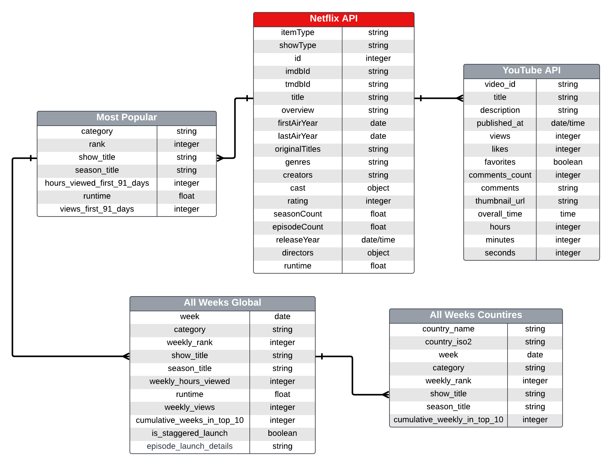
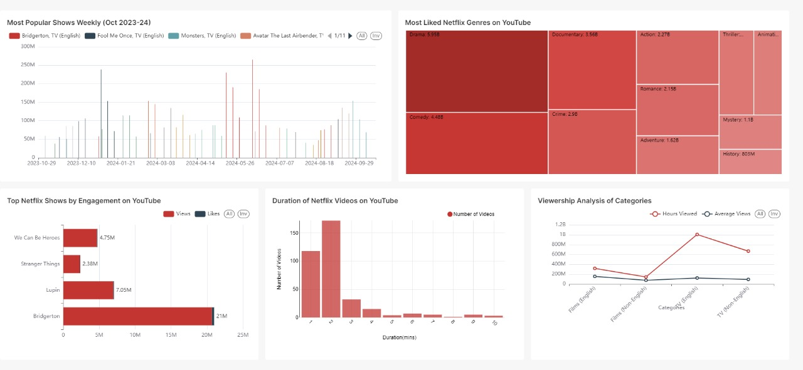

# Deploying Analytics Pipelines
A repository for a team project on "Deploying Analytics Pipelines" that involves three phases:
- Phase 1: Data Ops (ETL/ELT and Warehousing)
- Phase 2: ML Ops
- Phase 3: LLM Ops

## Phase 1: Data Ops
### Data Feeds
We are considering three data feeds for our project:
1. **Netflix Top 10 Weekly Data:** provides information on the most-watched TV shows and movies on Netflix globally and by country weekly. \
   *Link: https://www.netflix.com/tudum/top10/*
2. **Netflix API data:** has near real-time updated data on the shows and movies released on Netflix along with other key information. \
   *Link: https://rapidapi.com/movie-of-the-night-movie-of-the-night-default/api/streaming-availability*
3. **YouTube API data:** this gives insights into Netflix's content promotion strategies and audience engagement on Netflix's YouTube channel. \
   *Link: https://console.cloud.google.com/marketplace/product/google/youtube.googleapis.com?project=ba882-inclass-project*   

### Motivation
We are interested in these data feeds because they provide insights into Netflix’s content performance and marketing strategies. The Netflix Top 10 data offers direct information about viewer preferences on the streaming platform, while the YouTube data reveals how Netflix promotes its content and engages with audiences off-platform. By combining these datasets, we can better understand the relationship between Netflix’s content popularity and marketing efforts. Through trend analysis of trending videos and hashtags related to Netflix, we can identify current popular trends and audience preferences, which are crucial for content creators and brand marketing. We can impose specific conditions when collecting data, such as conducting a more detailed analysis for different regions. Additionally, by leveraging the YouTube Analytics API and YouTube Reporting API, we can access viewing statistics and popularity metrics for each video, enabling us to perform demographic analysis on specific types of videos. These insights can help Netflix select more suitable recommended content for different audience segments.

### Business Problem
Our project aims to explore several key business problems:
1. **Content Performance Analysis:** How do Netflix's most popular shows and movies perform over time, and what factors contribute to their success?
2. **Marketing Effectiveness:** Is there a correlation between Netflix's YouTube promotional activities and content performance on the Netflix platform?
3. **Audience Engagement:** How does audience engagement on YouTube (likes, comments, shares) relate to a show or movie's popularity on Netflix?
4. **Content Trend Prediction:** Can we use historical data from both sources to predict future trends in content popularity?
5. **Regional Preferences:** How do content preferences differ across regions, and how does Netflix tailor its YouTube marketing to different geographical audiences?
6. **Genre Analysis:** Which genres perform best on Netflix, and how does this align with the genre focus in their YouTube marketing?

### Data Model (ERD)
We extracted multidimensional data related to movies and shows released on Netflix from three different sources: the Netflix Top 10 weekly data website, the YouTube Data API v3 (specific to Netflix's YT Channel), and the Streaming Availability API (specific to Netflix). We then ingested this data into five connected tables that we designed as follows:

### Superset Dashboard 
In our project, we used MotherDuck as the data warehouse and Apache Superset to create visualizations. By linking MotherDuck with Apache Superset, we ensured seamless data flow and real-time updates in visualizations. This setup allowed us to derive meaningful insights from our data stored in the cloud data warehouse. The dashboard below provides some great insights from the Netflix and YouTube databases. It offers a clear snapshot of how Netflix content is performing and how viewers are engaging with it. 

